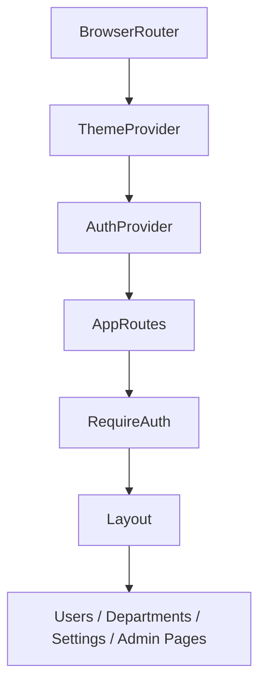

# DnDn-HR

<div align="center">

### DnDn 조직 운영을 위한 HR 포털 프론트엔드

사용자, 부서, 회사, 권한 운영을  
별도의 포털 경험으로 분리한 DnDn의 HR UI 저장소입니다.


</div>

---

## 소개

`DnDn-HR`는 DnDn 플랫폼에서 **사람 / 조직 / 회사 단위 운영 정보**를 다루는 프론트엔드 저장소입니다.

메인 운영 콘솔(`DnDn-App`)과 분리된 이유는 아래와 같습니다.

- 사용자 / 부서 / 회사 관리 UX를 독립적으로 구성하기 위해
- HR 성격의 관리 화면을 별도 포털로 분리하기 위해
- 플랫폼 기능 화면과 운영 권한 화면을 책임 단위로 나누기 위해

---

## 주요 화면

현재 라우팅 기준으로 아래 화면이 확인됩니다.

### 공통
- `/login`

### 일반 사용자 / 회사 관리자 영역
- `/users`
- `/users/register`
- `/users/:id`
- `/departments`
- `/settings`

### superadmin 영역
- `/admin/register`
- `/admin/companies`

---

## 권한 / 세션 흐름

이 앱은 `AuthProvider`와 `RequireAuth`를 사용해 인증 상태를 보호합니다.

### 동작 요약
- 인증 로딩 중에는 화면 전환을 보류합니다.
- 세션이 없으면 `/login`으로 이동합니다.
- `access_token`은 있는데 세션이 5초 안에 복구되지 않으면
  - `access_token`
  - `refresh_token`
  - `id_token`

  을 정리한 뒤 로그인 화면으로 보냅니다.
- `superadmin`이면 기본 진입 경로가 `/admin/companies`
- 그 외 사용자는 기본 진입 경로가 `/users`

> 즉, 이 저장소는 단순 정적 페이지가 아니라 **역할 기반 진입 흐름과 세션 복구 로직**을 가진 관리용 프론트엔드입니다.

---

## 기술 스택

| 영역 | 기술 |
|---|---|
| UI | React 19 |
| Language | TypeScript |
| Build Tool | Vite |
| Routing | React Router |
| Lint | ESLint |
| Delivery | Docker + ECR + GitOps |

---

## 빠른 시작

```bash
npm ci
npm run dev
```

### 자주 쓰는 명령어

```bash
npm run build
npm run preview
npm run lint
```

| 명령어 | 설명 |
|---|---|
| `npm run dev` | Vite 개발 서버 실행 |
| `npm run build` | TypeScript build 후 프로덕션 번들 생성 |
| `npm run preview` | 빌드 결과 미리보기 |
| `npm run lint` | ESLint 검사 |

---

## 현재 저장소 구조

```text
.
├── public/
├── src/
├── Dockerfile
├── nginx.conf
├── package.json
└── .github/workflows/deploy-hr.yml
```

---

## 앱 구조 요약

`src/App.tsx` 기준으로 보면 앱은 아래 레이어로 나뉩니다.

- `ThemeProvider`
- `AuthProvider`
- `Layout`
- role 기반 라우팅
- feature 단위 페이지 구성

즉, 단순 페이지 모음이 아니라 아래 구조를 따릅니다.



---

## 이 레포가 담당하는 범위

### ✅ 이 레포가 하는 일
- HR 포털 UI 개발
- 로그인 이후 권한 기반 라우팅
- 사용자 / 부서 / 회사 운영 화면
- Docker 이미지 빌드
- HR 앱 이미지 배포 파이프라인 트리거

### ❌ 이 레포가 하지 않는 일
- 플랫폼 공통 인프라 생성
- Argo CD 전체 구조 관리
- 메인 API / worker / report 서비스 운영
- EKS 배포 선언의 전체 소유

> 실제 인프라, GitOps 기준선, 운영 절차는 [`DnDn-Infra`](https://github.com/ACS-DnDn/DnDn-Infra)에서 관리합니다.

---

## 배포 방식

이 저장소는 `main` 브랜치 push 또는 수동 실행 시 **Build HR Image** workflow를 통해 배포용 이미지를 생산합니다.

### 트리거 대상
- `src/**`
- `public/**`
- `package.json`
- `package-lock.json`
- `tsconfig*`
- `vite.config.ts`
- `index.html`
- `Dockerfile`
- `nginx.conf`
- `.github/workflows/deploy-hr.yml`

### 배포 흐름
1. GitHub Actions가 이미지를 빌드합니다.
2. ECR에 `dndn-prd-hr` 이미지를 push 합니다.
3. [`DnDn-Infra`](https://github.com/ACS-DnDn/DnDn-Infra) 저장소의  
   `gitops/environments/prod/apps/dndn-hr/deployment.yaml`  
   이미지 태그를 갱신합니다.
4. Argo CD가 Git 변경을 감지해 rollout 합니다.

### 배포 대상
- ECR Registry: `387721658341.dkr.ecr.ap-northeast-2.amazonaws.com`
- Image: `dndn-prd-hr`

---

## 운영 런타임 관점에서 보면

Infra 운영 문서 기준으로 `dndn-hr`는 **nginx 기반 정적 서빙** 워크로드로 운영됩니다.

즉 이 저장소는 다음 흐름으로 이해하면 됩니다.

- 개발: React + Vite
- 패키징: Docker
- 런타임: EKS 위 정적 서빙 앱
- 반영 방식: GitOps + Argo CD

---

## 협업 시 참고하면 좋은 기준

### 이런 변경은 이 레포에서
- HR 화면 컴포넌트 수정
- 사용자 / 부서 / 회사 관련 UI 플로우 수정
- 로그인 이후 HR 포털 내 라우트 수정
- 스타일 / 테마 / 레이아웃 수정
- 프론트엔드 이미지 빌드 관련 수정

### 이런 변경은 다른 레포에서
- 플랫폼 인프라 수정 → `DnDn-Infra`
- 메인 서비스 API / worker / report 수정 → `DnDn-App`
- 조직 전체 프로필 / 공통 GitHub 설정 → `.github`

---

## 추천 보강 포인트

현재 공개 상태 기준으로는 이 저장소가 가장 많이 개선될 여지가 있습니다.  
README를 적용한 뒤 아래 항목까지 붙이면 완성도가 더 좋아집니다.

- `.env.example` 추가 및 API 연결값 문서화
- 주요 화면 스크린샷
- 컴포넌트 / feature 디렉터리 설명
- 권한 모델 표 (`superadmin`, 일반 사용자 등)
- 백엔드 API 연동 규칙 정리

---

## 관련 저장소

- [`ACS-DnDn/DnDn-App`](https://github.com/ACS-DnDn/DnDn-App) — 메인 애플리케이션 모노레포
- [`ACS-DnDn/DnDn-Infra`](https://github.com/ACS-DnDn/DnDn-Infra) — 인프라 / GitOps / 운영 문서
- [`ACS-DnDn/.github`](https://github.com/ACS-DnDn/.github) — 조직 프로필 / 공통 GitHub 설정

---

## 추천 GitHub About 문구

> HR portal frontend for users, departments, companies, and role-based operations in DnDn.

## 추천 Topics

`react` `typescript` `vite` `hr-portal` `admin-ui` `frontend` `auth` `organization-management`
